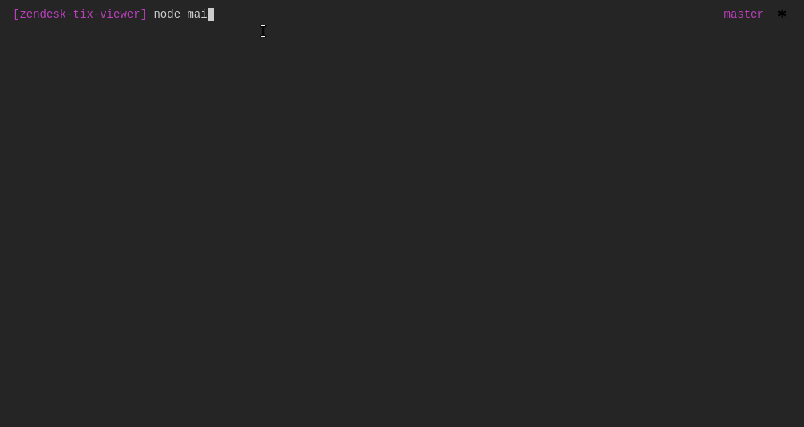

# zendesk-tix-viewer

## Installation
> `git clone git@github.com:herrowna/zendesk-tix-viewer.git`

> `npm install`

## Usage

1. `node main.js`

2. Login instructions are as below:

`subdomain: acmecorp,`

`user: hel@love.com,`

`password: zendesk`

3. Navigate the main menu via up and down keys.

## Run tests
> `npm test`

